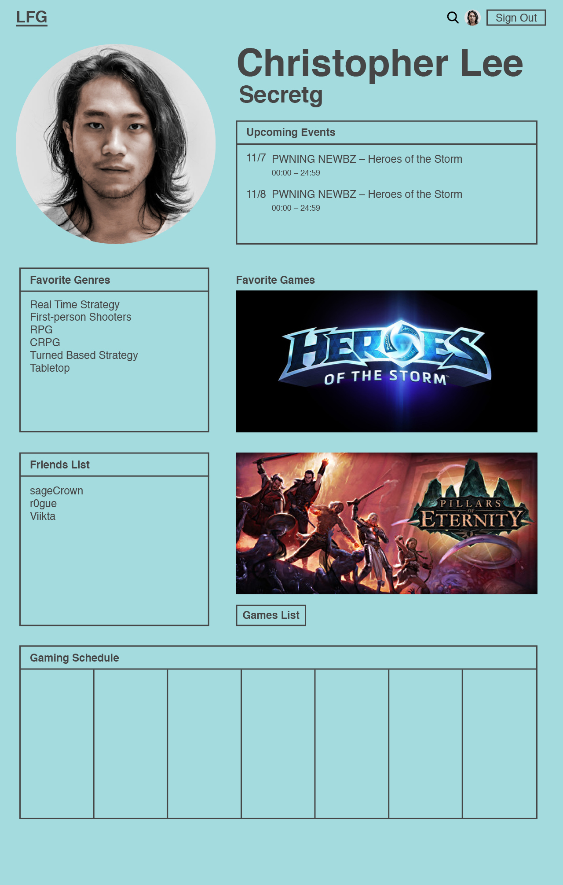

# Table of contents

* [About Looking for Game](#about-looking-for-game)
* [Installation](#installation)


# About Looking For Game

Looking For Game is a Meteor application providing game profiles for the University of Hawaii community. When you come to the site, you are greeted by the following landing page:


Anyone with a UH account can login to Looking For Game by clicking on the login button. The UH CAS authentication screen then appears and requests your UH account and password. Once authenticated, you can create a profile that provides a biographical statement and list of interests, plus links to selected social media sites (GitHub, FaceBook, Instagram):


  
After creating a profile, you will be listed on the public directory page:


# Installation

First, [install Meteor](https://www.meteor.com/install).

Second, [download a copy of Looking For Group](https://github.com/looking-for-game/looking-for-game/archive/master.zip), or clone it using git.
  
Third, cd into the app/ directory and install libraries with:

```
$ meteor npm install
```

Fourth, run the system with:

```
$ meteor npm run start
```

If all goes well, the application will appear at [http://localhost:3000](http://localhost:3000). If you have an account on the UH test CAS server, you can login. 


