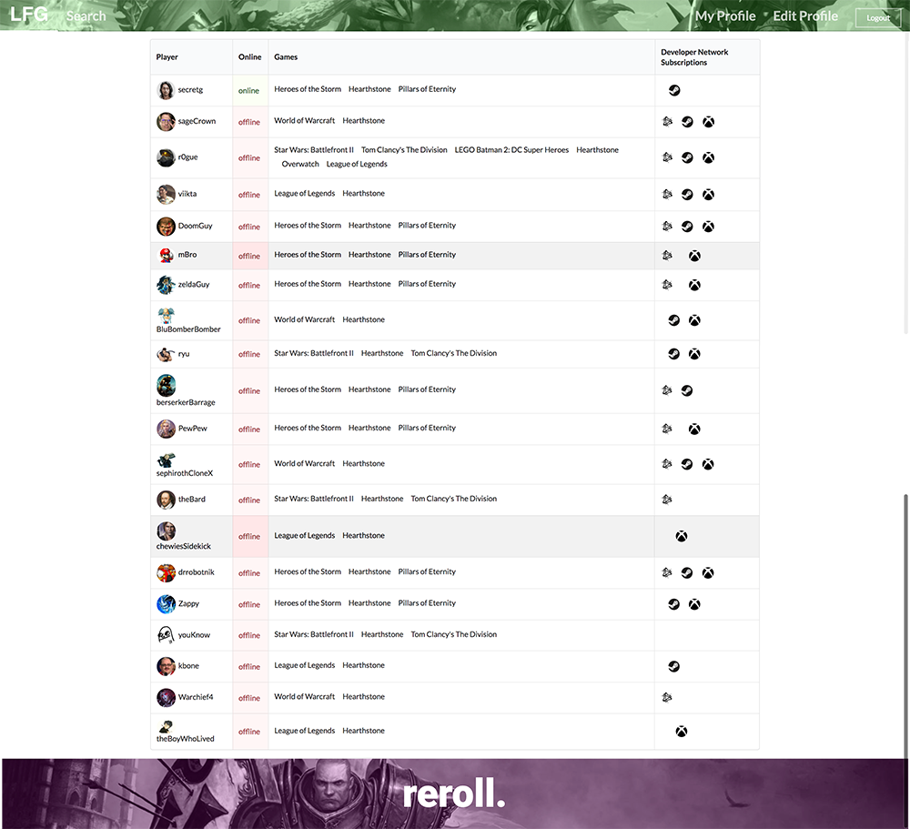

# Table of contents

* [About Looking for Game](#about-looking-for-game)
* [Development history](#development-history)
  * [Milestone 2: Prime Features](#milestone-2-prime-features)
  * [Milestone 1: Mockup Development](#milestone-1-mockup-development)
  * [Concept Presentation](#milestone-1-mockup-development)
* [Reviews and Feedback](#reviews-and-feedback)
* [Installation](#installation)
* [Application design](#application-design)


# About Looking For Game

Looking For Game is a Meteor application providing game profiles for the University of Hawaii community. When you come to the site, you are greeted by the following landing page:

Anyone with a UH account can login to Looking For Game by clicking on the login button. The UH CAS authentication screen then appears and requests your UH account and password. Once authenticated, you can create a profile that provides a biographical statement and list of interests, plus links to selected social media sites (GitHub, FaceBook, Instagram):

After creating a profile, you will be listed on the public directory page.


# Development History

The development process for Looking For Game conformed to [Issue Driven Project Management](http://courses.ics.hawaii.edu/ics314f16/modules/project-management/) practices. In a nutshell, development consists of a sequence of Milestones. Milestones consist of issues corresponding to 2-3 day tasks. GitHub projects are used to manage the processing of tasks during a milestone.  

The following sections document the development history of Looking For Game.


Here is a link to our current deployment: [http://lookingforgame.meteorapp.com](http://lookingforgame.meteorapp.com)


## Milestone 2: Prime Features

Milestone 2 goals viewable [here](https://github.com/looking-for-game/looking-for-game/projects/2).

Landing Page:


Search Page:


Profile Page:


Home Page:


Edit Profile:


## Milestone 1: Mockup Development

This milestone started on November 9, 2017 to present.

The goal of Milestone 1 was to create a set of HTML pages providing a mockup of the pages in the system. To simplify things, the mockup was developed as a Meteor app. This meant that each page was a template and that FlowRouter was used to implement routing to the pages.

Here is a link to our current deployment: [http://lookingforgame.meteorapp.com](http://lookingforgame.meteorapp.com)

Issues completed for Milestone 1 viewable [here](https://github.com/looking-for-game/looking-for-game/projects/1).

Below are screenshots of our progress through M1.

Landing Page:


Search Page:


Profile Page:


## Concept Presentation

Prior to the construction of the web app prototype, this presentation goes over the concept and target demographics of the program.

<iframe src="https://docs.google.com/presentation/d/e/2PACX-1vSKi10yvED8cOa2-O6Lccu5sxOjQ91kx9DD-xnKXfSDpu8kDQufYiQTcURvDidz9Yx50HNEpwEdO46d/embed?start=false&loop=true&delayms=3000" frameborder="0" width="480" height="299" allowfullscreen="true" mozallowfullscreen="true" webkitallowfullscreen="true"></iframe>


# Reviews and Feedback

A select handful of university students have provided some helpful opinions about LFG.

"This looks helpful. I like the integrated calendar. It would make it easy to organize and advertise events."
P.K.

"I like the idea, but I'm not sure that some players would want to broadcast their usernames like this. Security is an issue."
H.S.

"I wish there was a view of the games themselves, with the subscribed players. Other than that, it looks pretty good."
D.D.

"It looks like something I would use. Especially if I just arrived on campus and was interested in playing what is popular."
J.O.

"I like the design. Do you guys like Blizzard? I can't tell..."
N.F.


# Installation

First, [install Meteor](https://www.meteor.com/install).

Second, [download a copy of Looking For Group](https://github.com/looking-for-game/looking-for-game/archive/master.zip), or clone it using git.
  
Third, cd into the app/ directory and install libraries with:

```
$ meteor npm install
```

Fourth, run the system with:

```
$ meteor npm run start
```

If all goes well, the application will appear at [http://localhost:3000](http://localhost:3000). If you have an account on the UH test CAS server, you can login. 


# Application Design

## Directory structure

The top-level directory structure contains:

```
app/        # holds the Meteor application sources
config/     # holds configuration files, such as settings.development.json
.gitignore  # don't commit IntelliJ project files, node_modules, and settings.production.json
```

This structure separates configuration files (such as the settings files) in the config/ directory from the actual Meteor application in the app/ directory.

The app/ directory has this top-level structure:

```
client/
  lib/           # holds Semantic UI files.
  head.html      # the <head>
  main.js        # import all the client-side html and js files. 

imports/
  api/           # Define collection processing code (client + server side)
    base/
    interest/
    profile/
  startup/       # Define code to run when system starts up (client-only, server-only)
    client/        
    server/        
  ui/
    components/  # templates that appear inside a page template.
    layouts/     # Layouts contain common elements to all pages (i.e. menubar and footer)
    pages/       # Pages are navigated to by FlowRouter routes.
    stylesheets/ # CSS customizations, if any.

node_modules/    # managed by Meteor

private/
  database/      # holds the JSON file used to initialize the database on startup.

public/          
  images/        # holds static images for landing page and predefined sample users.
  
server/
   main.js       # import all the server-side js files.
```

## Import conventions

This system adheres to the Meteor 1.4 guideline of putting all application code in the imports/ directory, and using client/main.js and server/main.js to import the code appropriate for the client and server in an appropriate order.

This system accomplishes client and server-side importing in a different manner than most Meteor sample applications. In this system, every imports/ subdirectory containing any Javascript or HTML files has a top-level index.js file that is responsible for importing all files in its associated directory.   

Then, client/main.js and server/main.js are responsible for importing all the directories containing code they need. For example, here is the contents of client/main.js:

```
import '/imports/startup/client';
import '/imports/ui/components/form-controls';
import '/imports/ui/components/directory';
import '/imports/ui/components/user';
import '/imports/ui/components/landing';
import '/imports/ui/layouts/directory';
import '/imports/ui/layouts/landing';
import '/imports/ui/layouts/shared';
import '/imports/ui/layouts/user';
import '/imports/ui/pages/directory';
import '/imports/ui/pages/filter';
import '/imports/ui/pages/landing';
import '/imports/ui/pages/user';
import '/imports/api/base';
import '/imports/api/profile';
import '/imports/api/interest';
import '/imports/ui/stylesheets/style.css';
```

Apart from the last line that imports style.css directly, the other lines all invoke the index.js file in the specified directory.

We use this approach to make it more simple to understand what code is loaded and in what order, and to simplify debugging when some code or templates do not appear to be loaded.  In our approach, there are only two places to look for top-level imports: the main.js files in client/ and server/, and the index.js files in import subdirectories. 

Note that this two-level import structure ensures that all code and templates are loaded, but does not ensure that the symbols needed in a given file are accessible.  So, for example, a symbol bound to a collection still needs to be imported into any file that references it. 
 
## Naming conventions

This system adopts the following naming conventions:

  * Files and directories are named in all lowercase, with words separated by hyphens. Example: accounts-config.js
  * "Global" Javascript variables (such as collections) are capitalized. Example: Profiles.
  * Other Javascript variables are camel-case. Example: collectionList.
  * Templates representing pages are capitalized, with words separated by underscores. Example: Directory_Page. The files for this template are lower case, with hyphens rather than underscore. Example: directory-page.html, directory-page.js.
  * Routes to pages are named the same as their corresponding page. Example: Directory_Page.


## Data model

The Looking For Game data model is implemented by two Javascript classes: [ProfileCollection](https://github.com/looking-for-game/looking-for-game/blob/master/app/imports/api/profile/ProfileCollection.js) and [InterestCollection](https://github.com/looking-for-game/looking-for-game/blob/master/app/imports/api/interest/InterestCollection.js). Both of these classes encapsulate a MongoDB collection with the same name and export a single variable (Profiles and Interests)that provides access to that collection. 

Any part of the system that manipulates the Looking For Game data model imports the Profiles or Interests variable, and invokes methods of that class to get or set data.

There are many common operations on MongoDB collections. To simplify the implementation, the ProfileCollection and InterestCollection classes inherit from the [BaseCollection](https://github.com/looking-for-game/looking-for-game/blob/master/app/imports/api/base/BaseCollection.js) class.

The [BaseUtilities](https://github.com/looking-for-game/looking-for-game/blob/master/app/imports/api/base/BaseCollection.js) file contains functions that operate across both classes. 

Both ProfileCollection and InterestCollection have Mocha unit tests in [ProfileCollection.test.js](https://github.com/looking-for-game/looking-for-game/blob/master/app/imports/api/profile/ProfileCollection.test.js) and [InterestCollection.test.js](https://github.com/looking-for-game/looking-for-game/blob/master/app/imports/api/interest/InterestCollection.test.js). See the section below on testing for more details.

## CSS

The application uses the [Semantic UI](http://semantic-ui.com/) CSS framework. To learn more about the Semantic UI theme integration with Meteor, see [Semantic-UI-Meteor](https://github.com/Semantic-Org/Semantic-UI-Meteor).

The Semantic UI theme files are located in [app/client/lib/semantic-ui](https://github.com/ics-software-engineering/meteor-application-template/tree/master/blob/master/app/client/lib/semantic-ui) directory. Because they are located in the client/ directory and not the imports/ directory, they do not need to be explicitly imported to be loaded. (Meteor automatically loads all files into the client that are located in the client/ directory). 

Note that the user pages contain a menu fixed to the top of the page, and thus the body element needs to have padding attached to it.  However, the landing page does not have a menu, and thus no padding should be attached to the body element on that page. To accomplish this, the [router](https://github.com/looking-for-game/looking-for-game/blob/master/app/imports/startup/client/router.js) uses "triggers" to add an remove the appropriate classes from the body element when a page is visited and then left by the user. 

## Routing

For display and navigation among its four pages, the application uses [Flow Router](https://github.com/kadirahq/flow-router).

Routing is defined in [imports/startup/client/router.js](https://github.com/ics-software-engineering/meteor-application-template/blob/master/blob/master/app/imports/startup/client/router.js).

Looking For Game defines the following routes:

  * The `/` route goes to the public landing page.
  * The `/directory` route goes to the public directory page.
  * The `/<user>/profile` route goes to the profile page associated with `<user>`, which is the UH account name.
  * The `/<user>/filter` route goes to the filter page associated with `<user>`, which is the UH account name.


## Authentication

For authentication, the application uses the University of Hawaii CAS test server, and follows the approach shown in [meteor-example-uh-cas](http://ics-software-engineering.github.io/meteor-example-uh-cas/).

When the application is run, the CAS configuration information must be present in a configuration file such as  [config/settings.development.json](https://github.com/ics-software-engineering/meteor-application-template/blob/master/config/settings.development.json). 

Anyone with a UH account can login and use Looking For Game to create a portfolio.  A profile document is created for them if none already exists for that username.

## Authorization

The landing and directory pages are public; anyone can access those pages.

The profile and filter pages require authorization: you must be logged in (i.e. authenticated) through the UH test CAS server, and the authenticated username returned by CAS must match the username specified in the URL.  So, for example, only the authenticated user `johnson` can access the pages `http://localhost:3000/johnson/profile` and  `http://localhost:3000/johnson/filter`.

To prevent people from accessing pages they are not authorized to visit, template-based authorization is used following the recommendations in [Implementing Auth Logic and Permissions](https://kadira.io/academy/meteor-routing-guide/content/implementing-auth-logic-and-permissions). 

The application implements template-based authorization using an If_Authorized template, defined in [If_Authorized.html](https://github.com/looking-for-game/looking-for-game/blob/master/app/imports/ui/layouts/user/if-authorized.html) and [If_Authorized.js](https://github.com/looking-for-game/looking-for-game/blob/master/app/imports/ui/layouts/user/if-authorized.js).

## Configuration

The [config](https://github.com/looking-for-game/looking-for-game/tree/master/config) directory is intended to hold settings files.  The repository contains one file: [config/settings.development.json](https://github.com/looking-for-game/looking-for-game/tree/master/config/settings.development.json).

The [.gitignore](https://github.com/looking-for-game/looking-for-game/blob/master/.gitignore) file prevents a file named settings.production.json from being committed to the repository. So, if you are deploying the application, you can put settings in a file named settings.production.json and it will not be committed.

Looking For Game checks on startup to see if it has an empty database in [initialize-database.js](https://github.com/looking-for-game/looking-for-game/blob/master/app/imports/startup/server/initialize-database.js), and if so, loads the file specified in the configuration file, such as [settings.development.json](https://github.com/looking-for-game/looking-for-game/tree/master/config/settings.development.json).  For development purposes, a sample initialization for this database is in [initial-collection-data.json](https://github.com/looking-for-game/looking-for-game/blob/master/app/private/database/initial-collection-data.json).

## Quality Assurance

### ESLint

Looking For Game includes a [.eslintrc](https://github.com/looking-for-game/looking-for-game/blob/master/app/.eslintrc) file to define the coding style adhered to in this application. You can invoke ESLint from the command line as follows:

```
meteor npm run lint
```

ESLint should run without generating any errors.  

It's significantly easier to do development with ESLint integrated directly into your IDE (such as IntelliJ).

### Data model unit tests

To run the unit tests on the data model, invoke the script named 'test', which is defined in the package.json file:

```
meteor npm run test
```

This outputs the results to the console. Here is an example of a successful run, with timestamps removed:

```
dhcp-168-105-253-142:app Crleekwc$ meteor npm run test

> looking-for-game@ test /Users/Crleekwc/Documents/GitHub/looking-for-game/app
> cross-env TEST_WATCH=1 meteor test --driver-package meteortesting:mocha

[[[[[ Tests ]]]]]                             

=> Started proxy.                             
=> Meteor 1.6 is available. Update this project with 'meteor update'.
=> Started MongoDB.                           
I20171109-11:13:56.116(-10)?                  
I20171109-11:13:56.155(-10)? --------------------------------
I20171109-11:13:56.156(-10)? ----- RUNNING SERVER TESTS -----
I20171109-11:13:56.157(-10)? --------------------------------
I20171109-11:13:56.157(-10)? 
I20171109-11:13:56.158(-10)? 
I20171109-11:13:56.159(-10)? 
I20171109-11:13:56.159(-10)?   InterestCollection
=> Started your app.

=> App running at: http://localhost:3000/
    ✓ #define, #isDefined, #removeIt, #dumpOne, #restoreOne (67ms)
    ✓ #findID, #findIDs-10)? 
I20171109-11:13:56.162(-10)? 
I20171109-11:13:56.163(-10)?   ProfileCollection
    ✓ #define, #isDefined, #removeIt, #dumpOne, #restoreOne (61ms)
    ✓ #define (illegal interest)
    ✓ #define (duplicate interests)
I20171109-11:13:56.165(-10)? 
I20171109-11:13:56.166(-10)? 
I20171109-11:13:56.166(-10)?   5 passing (175ms)
I20171109-11:13:56.167(-10)? 
I20171109-11:13:56.168(-10)? Load the app in a browser to run client tests, or set the TEST_BROWSER_DRIVER environment variable. See https://github.com/meteortesting/meteor-mocha/blob/master/README.md#run-app-tests
```


### JSDoc

Looking For Game supports documentation generation with [JSDoc](http://usejsdoc.org/). The package.json file defines a script called jsdoc that runs JSDoc over the source files and outputs html to the ../../looking-for-game.github.io/jsdoc directory.  When committed, the index.html file providing an overview of all the documentation generate at that point in time is available at [http://looking-for-game.github.io/jsdocs](https://looking-for-game.github.io/jsdocs/). 
